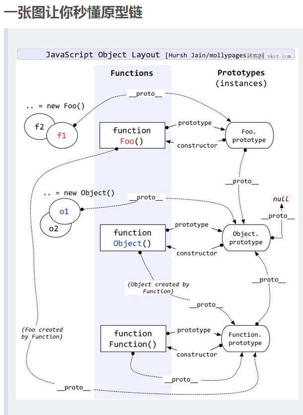


#JavaScript 中的原型链
=

    一、原型对象的用途是为每个实例对象存储共享的方法和属性,
    它仅仅是一个普通对象而已,并且所有的实例共享同一个原型对象,
    因此有别于实例方法和属性。
    
    二、注意不能随便改变原型prototype的指向,如果要在其上添加属性或方法,
    应该使用 Object.assign(XXX.prototype,{xxx:xxx});
    
    三、在js中,对象调用一个属性或方法,会首先在自身寻找是否有该属性或方法,
    如果没有,就会去原型链上找,依次层层递进,这里的原形链就是实例对象的proto属性
    

总结: 
    
函数的原型对象constructor 默认指向函数本身,原型对象除了有原型属性外,为了实现继承,
    还有原型链指针__proto__,该指针执行上一层的原型对象,而上一层的原型对象的结构依然类似,
    这样利用__proto__ 一直指向Object的原型对象上,
    而Object的原型对象用Object.prototype.__proto__ = null表示原型链的最顶端,
    如此变性成了javascript的原型链继承,同时也解释了为什么所有的javascript对象都具有Object的基本方法。
    Object的原型对象并不是null，应该是Function.prototype（Object本身是一个构造函数），
    Object.prototype的原型是null。

    
    
    